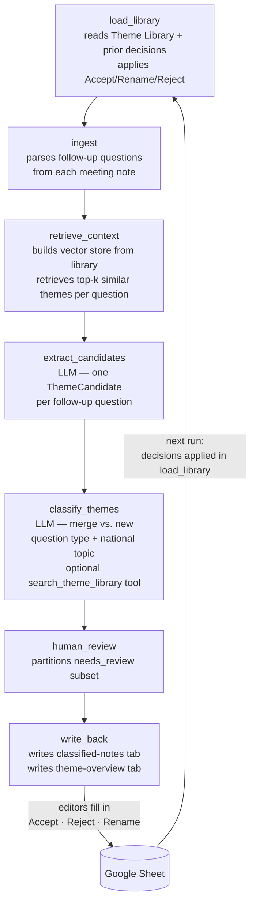

# Documenters Notes Agent

A LangGraph pipeline that reads Cleveland Documenter meeting notes from Google Drive, extracts follow-up questions, classifies them by recurring civic sub-topic and question type, and writes results to a Google Sheet for editorial review. Each run builds on prior reviewer decisions — the Theme Library grows over time and improves classification quality.

For the full system design, see `ARCHITECTURE.md`. For the editorial team's guide to the Google Sheet, see `docs/client-guide.md`. For repo conventions and current code structure, see `AGENTS.md`.

---

## Graph



---

## How it works

1. **fetch** — pull Google Docs from a Drive folder into a local manifest JSON
2. **ingest** — parse each doc: extract follow-up questions, summary, notes, single signal
3. **retrieve** — query the Theme Library for similar past sub-topics (cold start: empty)
4. **extract** — LLM identifies candidate sub-topics from the follow-up questions
5. **classify** — LLM decides merge vs. new; assigns question type and national topic; optionally calls `search_theme_library` tool for additional retrieval context
6. **write** — appends two new tabs to the Google Sheet:
   - `classified-notes-YYYY-MM-DD` — one row per question, decision columns blank for editors
   - `theme-overview-YYYY-MM-DD` — materialized Theme Library cache for the next run

Editors fill in Accept / Reject / Rename decisions in the classified-notes tab. Those decisions are applied at the start of the next run to update the Theme Library.

---

## Requirements

- Python 3.12+
- [`uv`](https://docs.astral.sh/uv/)
- OpenAI API key
- Google service account credentials with Sheets + Drive access
- An existing Google Sheet (the pipeline appends tabs; it does not create the spreadsheet)

---

## Setup

```bash
uv sync
```

Copy `.env.example` to `.env` and fill in:

```
OPENAI_API_KEY=sk-...
GOOGLE_APPLICATION_CREDENTIALS=/path/to/service-account.json
ROOT_DRIVE_FOLDER=<Drive folder ID>
CLASSIFIER_OUTPUT_SHEET=<Google Sheet ID>

# Optional
GOOGLE_IMPERSONATE_USER=user@example.com   # domain-wide delegation
LANGSMITH_TRACING=true                     # LangSmith tracing
LANGSMITH_API_KEY=lsv2_...
LANGSMITH_PROJECT=cle-documenters
```

---

## Running

### Step 1 — Fetch docs from Drive

```bash
uv run documenters-cle-langchain fetch \
  --folder DRIVE_FOLDER_ID \
  --out data/manifest_2026.json \
  --year 2026
```

Fetches all docs from the folder, deduplicates, and writes a manifest JSON. Use `--month March` to narrow to a single month.

### Step 2 — Run the pipeline

```bash
uv run documenters-cle-langchain pipeline \
  --manifest data/manifest_2026.json \
  --out data/run_summary.json \
  --sheet-id YOUR_SHEET_ID
```

Reads the manifest, runs the full LangGraph pipeline, and writes two new tabs to the Sheet. `--sheet-id` defaults to the `CLASSIFIER_OUTPUT_SHEET` env var. `--run-date YYYY-MM-DD` overrides the tab date (defaults to today).

### Dedup only

```bash
uv run documenters-cle-langchain dedup \
  --input data/manifest_2026.json \
  --review data/dedup_review.md
```

Deduplicates a manifest in place and optionally writes a markdown review of dropped docs.

---

## Development

```bash
uv run pytest          # run all tests
uv run pytest -x -q    # fail fast, quiet
```

Key modules:

| File | Purpose |
|------|---------|
| `cli.py` | CLI entry points: `fetch`, `pipeline`, `dedup` commands |
| `graph.py` | LangGraph graph definition, node wiring, `GraphConfig` |
| `ingest.py` | Document parsing, section extraction, required-field gate |
| `retrieve_context.py` | Theme Library vector store; per-question semantic retrieval |
| `extract_candidates.py` | LLM extraction of candidate sub-topics from follow-up questions |
| `classify_themes.py` | LLM merge/split decision, question type, and national topic assignment |
| `theme_library.py` | `ThemeRecord` schema, Sheets read/write, vector store construction |
| `feedback.py` | Applies Accept/Rename/Reject decisions to produce the updated Theme Library |
| `write_back.py` | Classified notes tab layout, row construction, and Sheets formatting |
| `text_extract.py` | Google Docs paragraph and hyperlink extraction to plain text |
| `gdrive.py` | Google Drive / Docs API client |

---

## Eval

```bash
uv run python evals/eval_classify.py
```

Runs `classify_one` against 11 real fixture questions with known expected outputs. Requires `OPENAI_API_KEY` and `LANGSMITH_API_KEY`. Results appear in LangSmith.

---

## What I'd improve with more time

The [open issue queue](https://github.com/eads/cle-documenters-classify-notes/issues) is the living backlog. The highest-priority items:

**Custom review frontend ([#66](https://github.com/eads/cle-documenters-classify-notes/issues/66)).** The Google Sheet works and was the right choice for a first version — zero setup for the editorial team, familiar UX, no deployment. But a purpose-built review UI would be meaningfully better: keyboard shortcuts for Accept/Reject/Rename, inline diff view showing what changed from the prior run, batch actions, and a clearer display of retrieved similar themes. The Sheet's column layout is workable but it's not optimized for fast review at volume.

**Occurrence count accumulation across runs ([#59](https://github.com/eads/cle-documenters-classify-notes/issues/59)).** The current chain accumulates counts through the theme-overview → apply_decisions chain, but there's a suspected bug where the count only reflects the most recent reviewed run rather than all history. Needs a multi-run integration test to confirm the behavior and fix the chain if needed.

**Cost optimization ([#67](https://github.com/eads/cle-documenters-classify-notes/issues/67)).** The system currently uses GPT-5.4 for all LLM calls during the bootstrapping phase. LangSmith traces will reveal which nodes actually need frontier-model quality and which can drop to a smaller model. The merge/split judgment is likely the last to downgrade; extraction and question-type classification are candidates for a mini model. This matters for scale — the client hopes to extend to ~31 Documenters chapters.

**Venue/meeting body knowledge base ([#68](https://github.com/eads/cle-documenters-classify-notes/issues/68)).** The `venue_context` slot in `retrieve_context.py` is wired but empty. A knowledge base of meeting body mandates, histories, and recurring participants would improve topic assignment for domain-specific questions (e.g., distinguishing a land bank governance question from a general housing question).

**Question stance ontology ([#75](https://github.com/eads/cle-documenters-classify-notes/issues/75)).** The five question types (`knowledge_gap`, `process_confusion`, `skepticism`, `accountability`, `continuity`) are always going to be fuzzy, but the current set has gaps — notably, there's no category for "this needs more reporting," which is a distinct posture that doesn't fit any existing type. `knowledge_gap` and `process_confusion` also overlap heavily in practice. The right taxonomy should be validated against real Documenter questions with Signal Cleveland editorial stakeholders before any schema changes are made.

**Multi-run strategy: incremental vs. full-corpus re-runs ([#74](https://github.com/eads/cle-documenters-classify-notes/issues/74)).** The current model assumes incremental runs over new date ranges, but the right long-term workflow is an open question. Overlapping re-runs inflate occurrence counts; running only new meetings loses the benefit of reclassifying old questions against an improved library. An alternative — stabilize the library on a sample, then do one authoritative full-corpus run — is simpler but loses the incremental feedback loop. Worth resolving before the library matures.
