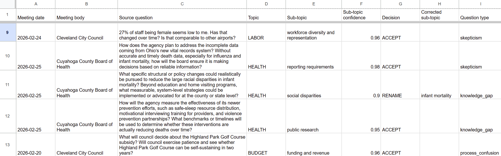
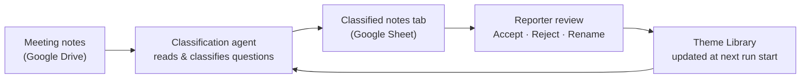

# Signal Cleveland — Documenters Notes Agent: Editorial Guide

This guide is for Cleveland Documenters along with Signal Cleveland reporters and editors who use the Documenters Notes Agent. It covers what the system does, how to read the Google Sheet, how to fill in a decision row, and how to trigger a run. No technical background required. 

---

## What this system does

Cleveland Documenters attend hundreds of public meetings each year and file structured notes. At the end of each set of notes, reporters flag **follow-up questions** — things they didn't understand, wanted to investigate further, or noticed weren't being followed up on.

Individually, each question is a small signal. In aggregate, across many meetings over time, they provide indirect but important signals about what Cleveland communities are confused about, skeptical of, and not getting answers on.

This system reads those notes from Google Drive, identifies the civic issues each follow-up question is about, and builds a running record of recurring themes over time. The output lands in a Google Sheet where you review and confirm (or correct) what the system proposed. Those corrections are then fed back into the system. 

**What it is not:** This system doesn't replace editorial judgment. It surfaces patterns. You confirm, reject, and rename. The system learns from your decisions.

---

## The Theme Library

At the heart of the system is the **Theme Library** — a growing catalog of civic sub-topics that have appeared in Documenter notes. Examples: "lead pipe replacement funding," "magnet school enrollment caps," "transit service cuts."

When the system processes new meeting notes, it checks the Theme Library first: *Is this question about something we're already tracking, or is this a new issue?* Over time, as the library grows, the system gets better at recognizing recurring themes and connecting new questions to existing ones.

The Theme Library starts empty and grows through your decisions. Early runs will surface more new themes than later runs. After a few review cycles, many questions will connect to themes the library already knows about.

---

## The Google Sheet

Each run produces a new tab in the Google Sheet. There are two kinds of tabs:

- **classified-notes-YYYY-MM-DD** — the working sheet for that run. One row per follow-up question. This is where you work.
- **theme-overview-YYYY-MM-DD** — a read-only summary of the Theme Library after that run. You can read it to understand what themes exist, but don't edit it — the system regenerates it each run. It's there for your reference.

### Quick orientation to the classified notes tab

Each row is one follow-up question from one meeting. The system has already filled in its best guesses for sub-topic, topic, and question type. Your job is to look at the **Sub-topic decision** column and decide: Accept, Reject, or Rename.

A reporter with no prior context should be able to decide a row in under a minute. If a row takes longer than that, check the **Retrieved similar themes** column — it's there specifically to help you make borderline calls quickly.

---

## Column guide

### Columns the system fills in (read-only)

| Column | What it contains |
|--------|------------------|
| **Meeting date** | When the meeting happened |
| **Meeting body** | Which public body held the meeting (e.g., "Cleveland City Council") |
| **Source question** | The follow-up question exactly as the reporter wrote it |
| **Topic** | Broad category from the national Documenters taxonomy (e.g., HOUSING, EDUCATION, TRANSPORTATION) |
| **Topic decision / Corrected topic** | Your decision on the topic assignment (blank on write) |
| **Sub-topic** | The specific civic issue the question is about — the system's core classification |
| **Sub-topic confidence** | How confident the system is in its sub-topic classification (0–1). Rows below 0.7 are flagged for review. |
| **Sub-topic decision / Corrected sub-topic** | Your decision on the sub-topic (blank on write) |
| **Question type** | What kind of question it is (see below) |
| **Question type confidence** | How confident the system is in the question type (0–1) |
| **Question type decision / Corrected question type** | Your decision on the question type (blank on write) |
| **Needs review** | "yes" if the system is uncertain and wants your input. Use this to filter for priority rows. |
| **GDoc URL** | Link to the source Google Doc (the original meeting notes) |
| **Sub-topic description** | A one-sentence description of what this sub-topic covers — reference only, scroll right to see it |
| **Retrieved similar themes** | Existing sub-topics from the library most similar to this question — the evidence behind the proposed classification |

**Question types:**

| Type | Meaning |
|------|---------|
| Knowledge gap | The reporter doesn't understand how a process or program works |
| Process confusion | The reporter doesn't understand how a decision is made or who has authority |
| Skepticism | A challenge or critique framed as a question, often rooted in lived community experience |
| Accountability | Something was promised or required and hasn't happened |
| Continuity | A prior thread that hasn't been picked up again |

### Columns you fill in

Each agent-assigned field — sub-topic, topic, and question type — has a matching decision column with a dropdown (Accept / Reject / Rename) and a corrected-value column used only when the decision is Rename.

| Column | When to fill it in |
|--------|--------------------|
| **Sub-topic decision** | Every row you review. Choose **Accept**, **Reject**, or **Rename** from the dropdown. |
| **Corrected sub-topic** | Only when Sub-topic decision is **Rename**. The label you want — either an existing sub-topic to merge into, or a new name. |
| **Topic decision** | Only if the topic assignment is wrong. Choose **Rename**, then enter the correct topic in Corrected topic. |
| **Corrected topic** | Only when Topic decision is **Rename**. Choose from the dropdown (national Documenters taxonomy values). |
| **Question type decision** | Only if the question type is wrong. Choose **Rename**, then enter the correct type in Corrected question type. |
| **Corrected question type** | Only when Question type decision is **Rename**. Choose from the dropdown. |
| **Notes** | Optional. Any context for editors or for the next run. |

---

## How to fill in a decision row

The Sub-topic decision column is the primary decision. Topic and question type decisions are optional corrections — only fill them in if you disagree with the system's assignment.

### Accept

The system's proposed sub-topic is correct. No further action needed.

**When to Accept:** The sub-topic label is accurate and useful as a recurring theme name. You'd recognize this label in a summary report.

### Reject

This question doesn't represent a meaningful, trackable theme — or the classification is so far off that correcting it would take more time than it's worth.

**When to Reject:** The question is too vague to track ("can you follow up on this?"), too specific to ever recur (a one-time procedural question about a single meeting), or clearly misclassified.

Rejected rows are discarded. They won't appear in future analysis.

### Rename

The proposed sub-topic is close but not quite right — either the label needs improvement, or this question belongs under a theme that already exists in the library.

**When to Rename:**
- The sub-topic is a duplicate of an existing theme with a different name → type the existing theme's exact label in **Corrected sub-topic** to merge them.
- The sub-topic label is awkward, too narrow, or too broad → type a better name in **Corrected sub-topic**.
- The system proposed a new theme but you recognize it as a variant of something already tracked → Rename into the existing sub-topic.

**Why this matters:** Renaming into an existing sub-topic is how you prevent the library from fragmenting into near-duplicates like "housing affordability" and "affordable housing." The Theme Library is only useful if similar things share the same label.

---

## Understanding "Retrieved similar themes"

This column shows up to three existing themes from the library that are most similar to the question being reviewed. For each retrieved theme, you'll see the theme name, its description, and its topic category.

This column is most important for **Rename decisions**. Before creating a new sub-topic or choosing a new label, check what's already in the library. If a retrieved sub-topic is a good match, use its exact label as the Corrected sub-topic.

If the Theme Library is empty (first run) or sparse (early runs), this column will often be blank. That's expected — it fills in as you approve more themes over successive runs.

---

## What happens to your decisions

Your decisions don't take effect immediately — they're applied at the **start of the next run**.

At the start of each run, the system:
1. Reads the most recent theme-overview tab (the current state of the library)
2. Reads your Accept/Rename/Reject decisions from the classified notes tab
3. Applies them: Accepts and Renames update the library; Rejects are discarded
4. Processes the meeting notes included in the current run with the updated library

This means **you don't need to finish reviewing before the next run starts** — whatever decisions are in the sheet get applied. Unreviewed rows are carried forward for the next run's context.

---

## The feedback loop

Each run, if you fill in the decision columns, the library gets a little better at recognizing recurring themes. Borderline classifications become clearer. The proportion of rows flagged for review shrinks over time.

---

## When to trigger a run

The system runs on demand — nothing happens automatically. Trigger a run when:

- **Quarterly or before a coverage planning cycle** — the minimum cadence. Monthly is better once the library is stable.
- **After completing a review pass** — if you've filled in Decision rows from the previous run, triggering a new run will apply those decisions and give you a fresh set of classifications to review.
- **After a significant batch of new meetings** — if many new notes have been filed, a fresh run will process them and surface new themes.

### How to trigger

Runs are triggered via GitHub Actions — a button in the project repository. The technical setup is covered in the operator guide. From the editorial side, you need:

1. Access to the GitHub repository (ask your operator if you don't have it)
2. To click **Run workflow** on the Actions tab

One month of notes takes about 10 minutes. When it finishes, two new tabs will appear in the Google Sheet: a classified notes tab and a theme overview tab, both dated to the run day.

**What to expect during the run:** The system is running silently. You'll see a progress indicator in GitHub Actions. If it fails, the operator will investigate. No partial results are written — either both tabs appear, or neither does.

---

## Quick reference

| Task | How |
|------|-----|
| Find rows that need review | Filter **Needs review** column for "yes" |
| Accept a sub-topic | Choose **Accept** in Sub-topic decision |
| Reject a sub-topic | Choose **Reject** in Sub-topic decision |
| Rename / merge a sub-topic | Choose **Rename** in Sub-topic decision + correct label in Corrected sub-topic |
| Correct the topic | Choose **Rename** in Topic decision + correct value in Corrected topic |
| Correct the question type | Choose **Rename** in Question type decision + correct value in Corrected question type |
| Check what sub-topics exist | Read the most recent theme-overview tab |
| Trigger a new run | GitHub Actions → Run workflow (or ask operator) |
